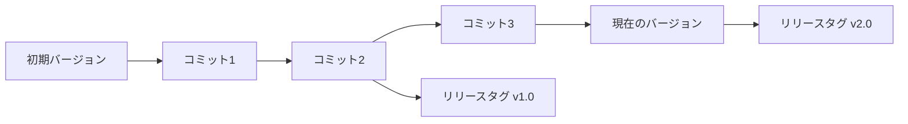

# バージョン管理ガイド

このドキュメントでは、OpenFisca Editor におけるGitを利用したバージョン管理システムについて詳しく説明します。

## 目次

- [バージョン管理の概要](#バージョン管理の概要)
- [コミット履歴](#コミット履歴)
- [リリースタグ](#リリースタグ)
- [バージョン間の比較](#バージョン間の比較)
- [特定バージョンへの復元](#特定バージョンへの復元)
- [コミットメッセージの書き方](#コミットメッセージの書き方)
- [ブランチとマージ](#ブランチとマージ)
- [公開プロセス](#公開プロセス)

## バージョン管理の概要

OpenFisca Editor は、制度のすべての変更履歴を自動的に記録します。これにより、制度の変更履歴を追跡し、必要に応じて過去のバージョンに戻すことができます。バージョン管理システムは以下の主要コンポーネントで構成されています：

- **コミット**: 制度に変更を加えて保存するたびに作成される変更の記録
- **バージョン履歴**: すべてのコミットの時系列リスト
- **タグ**: 特定のコミットに付けるラベル（リリースを表すために使用）
- **差分**: 2つのバージョン間の変更内容

### 技術的実装

バージョン管理システムは以下の要素で構成されています：

- **ローカルストレージ**: ブラウザのローカルストレージでバージョン履歴を保持
- **Gitサポート**: バックエンドが利用可能な場合、Gitリポジトリと連携
- **フォールバック機能**: バックエンドが利用できない場合もローカルでバージョン管理

この仕組みは主に `lib/git-api.ts` と `lib/git-utils.ts` に実装されています。Gitリポジトリとの連携は、バックエンドが利用可能な場合のみ機能します。



## コミット履歴

制度に変更を加えて保存すると、自動的にコミットが作成されます。各コミットには以下の情報が含まれます：

- **コミットハッシュ**: コミットを一意に識別する文字列
- **タイムスタンプ**: コミットが作成された日時
- **コミットメッセージ**: 変更内容の説明
- **変更内容**: 制度のどの部分が変更されたか
- **テスト結果**: コミット時点でのテスト実行結果（成功/失敗）

### コミット履歴の確認方法

1. 制度詳細画面で「履歴」ボタンをクリックすると、バージョン履歴ダイアログが表示されます。
2. 履歴リストには、最新のコミットが上に表示されます。
3. 各コミットについて、コミットハッシュ、メッセージ、タイムスタンプ、テスト結果が表示されます。
4. コミットをクリックすると、そのコミットの詳細（変更内容の差分）が表示されます。

```
バージョン履歴

[2023-12-15 14:30] コミットハッシュ: a1b2c3d4
「パラメータ値の更新」
✓ テスト成功: 全4件中4件成功

[2023-12-10 09:15] コミットハッシュ: e5f6g7h8
「計算ロジックの修正」
✓ テスト成功: 全4件中4件成功

[2023-12-05 17:45] コミットハッシュ: i9j0k1l2
「制度の初期作成」
✗ テスト失敗: 全4件中2件失敗
```

## リリースタグ

リリースタグは、制度の特定のバージョンに名前とメッセージを付けて管理するための機能です。重要なマイルストーンや、公開されたバージョンにタグを付けることで、後から簡単に参照できるようになります。

### リリースタグの作成

1. 制度詳細画面で「リリース」ボタンをクリックします。
2. 「新しいリリースを作成」ダイアログが表示されます。
3. 以下の情報を入力します：
   - **タグ名**: バージョン番号（例：v1.0.0）
   - **リリースメッセージ**: このリリースの概要や注意点
4. 「リリースする」ボタンをクリックします。

### タグの命名規則

リリースタグには、一般的にセマンティックバージョニングの形式を使用することをお勧めします：

```
vメジャー.マイナー.パッチ
```

- **メジャー**: 大きな変更や後方互換性のない変更があった場合に増やします
- **マイナー**: 後方互換性のある新機能が追加された場合に増やします
- **パッチ**: バグ修正や小さな調整のみの場合に増やします

例: `v1.0.0`, `v1.1.0`, `v1.1.1`

## バージョン間の比較

2つのバージョン間の違いを確認することで、制度の変更内容を詳細に分析できます。

### 比較方法

1. バージョン履歴ダイアログで、比較したい2つのコミットを選択します。
2. 「比較」ボタンをクリックします。
3. 比較ビューが表示され、以下の違いが表示されます：
   - **基本情報の変更**: 制度名、概要、利用条件など
   - **フォーミュラコードの変更**: 削除された行は赤、追加された行は緑で表示
   - **テストケースの変更**: 追加、削除、変更されたテストケース
   - **パラメータの変更**: 追加、削除、変更されたパラメータ

```diff
@@ -10,7 +10,7 @@
   value_type = int
   entity = 世帯
   definition_period = DAY
-  label = "旧制度の説明"
+  label = "新制度の説明"

   def formula(対象世帯, 対象期間, parameters):
-      return 古いロジック
+      return 新しいロジック
```

## 特定バージョンへの復元

過去のバージョンに問題がある場合や、以前の状態に戻したい場合は、特定のバージョンに復元することができます。

### 復元方法

1. バージョン履歴ダイアログで、復元したいコミットを選択します。
2. 「このバージョンに戻す」ボタンをクリックします。
3. 確認ダイアログが表示されるので、「はい」をクリックします。
4. 制度が選択したバージョンの状態に復元されます。

**注意**: バージョンを復元すると、現在の変更内容が失われる可能性があります。必要に応じて、復元前に現在の状態を保存しておくことをお勧めします。

## コミットメッセージの書き方

良いコミットメッセージは、変更内容を簡潔に説明し、後から見直した際に変更の理由や内容が理解できるものです。

### コミットメッセージのガイドライン

1. **簡潔で具体的に**: 何が変更されたかを明確に示す
2. **現在形を使用**: 「修正した」ではなく「修正する」
3. **変更理由を含める**: なぜその変更が必要だったか

### 良いコミットメッセージの例

```
パラメータ値を2024年度の数値に更新

- 児童手当の3歳未満支給額を15,000円から16,000円に変更
- 所得制限の閾値を960万円から980万円に変更
- これらの変更は2024年4月1日から適用される新制度に対応
```

### AIコミットメッセージ生成

OpenFisca Editorには、変更内容を分析して自動的にコミットメッセージを生成するAI機能があります。この機能を使用するには：

1. 変更を保存する際に「AIコミットメッセージを生成」オプションを選択します。
2. システムが変更を分析し、適切なコミットメッセージを提案します。
3. 必要に応じてメッセージを編集し、「保存」ボタンをクリックします。

## ブランチとマージ

OpenFisca Editorの現在のバージョンでは、単一のブランチ（メインブランチ）でのみ作業することができます。将来のバージョンでは、複数のブランチを作成して並行して作業できるようになる予定です。

## 公開プロセス

制度を公開するプロセスは、リリースタグの作成と密接に関連しています。

### 公開手順

1. 制度の変更が完了し、すべてのテストが成功していることを確認します。
2. 制度詳細画面で「公開」ボタンをクリックします。
3. 公開ダイアログで以下の情報を入力します：
   - **公開範囲**: 「公開」、「限定公開」、「非公開」から選択
   - **リリースタグ名**: バージョン番号（例：v1.0.0）
   - **リリースメッセージ**: このリリースの概要や注意点
4. 「公開する」ボタンをクリックします。

### 公開ステータス

制度には以下の公開ステータスがあります：

- **非公開（private）**: 作成者のみがアクセス可能
- **限定公開（restricted）**: 特定のユーザーやグループのみがアクセス可能
- **公開（public）**: すべてのユーザーがアクセス可能

公開ステータスは、制度詳細画面の「設定」から変更できます。

## ベストプラクティス

1. **頻繁にコミットする**: 大きな変更を一度に行うのではなく、小さな変更を頻繁にコミットしましょう
2. **テスト成功後にリリースタグを作成する**: すべてのテストが成功した状態でリリースタグを作成しましょう
3. **コミットメッセージを丁寧に書く**: 将来の自分や他の人が変更内容を理解できるよう、丁寧なコミットメッセージを書きましょう
4. **定期的にバックアップを取る**: 重要な変更前には、エクスポート機能を使用してバックアップを取りましょう
