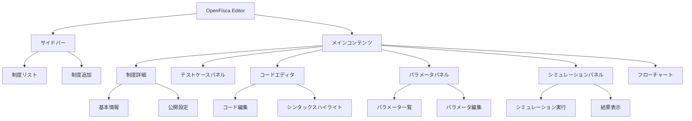
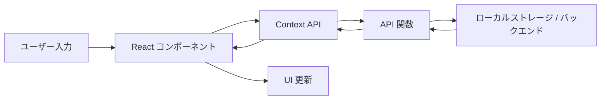

# OpenFisca Editor アーキテクチャ

このドキュメントでは、OpenFisca Editor のアーキテクチャと技術スタックについて説明します。

## 技術スタック

- **フロントエンド**: Next.js（React）、TypeScript
- **スタイリング**: Tailwind CSS、shadcn/ui コンポーネント
- **状態管理**: React Context API
- **データ保存**: ローカルストレージ（クライアントサイド）
- **バックエンド接続**: OpenFisca API（オプション）

## アプリケーション構造

## ディレクトリ構造

アプリケーションは以下のディレクトリ構造で整理されています：

- `app/`: Next.js アプリケーションのルートディレクトリ
  - `page.tsx`: ホームページ
  - `layout.tsx`: アプリケーションレイアウト
  - `globals.css`: グローバルスタイル
  - `api/`: API ルート
    - `openai/`: OpenAI API 関連
- `components/`: React コンポーネント
  - `ui/`: 汎用的な UI コンポーネント（shadcn/ui）
  - `editor/`: コードエディタ関連のコンポーネント
  - `institution/`: 制度関連のコンポーネント
  - `test/`: テスト関連のコンポーネント
  - `visualization/`: 可視化関連のコンポーネント
  - `simulation/`: シミュレーション関連のコンポーネント
  - `layout/`: レイアウト関連のコンポーネント
  - `shared/`: 共有コンポーネント
- `contexts/`: React コンテクスト
- `lib/`: ユーティリティ関数、型定義など
  - `types.ts`: アプリケーション全体の型定義
  - `api.ts`: API 関数
  - `utils.ts`: ユーティリティ関数
  - `i18n/`: 国際化関連
- `public/`: 静的ファイル
- `docs/`: ドキュメント

## データフロー

## 主要コンポーネント

### OpenFiscaEditor

アプリケーションのメインコンポーネントで、制度の管理と表示を担当します。

### InstitutionDetails

選択された制度の詳細情報を表示・編集するコンポーネントです。

### TestCasePanel

制度のテストケースを管理するコンポーネントです。

### CodeEditorPanel

OpenFisca のコードを編集するコンポーネントです。

### ParameterPanel

制度のパラメータを管理するコンポーネントです。

### SimulationPanel

シミュレーションを実行し、結果を表示するコンポーネントです。

### MermaidPanel

制度のフローチャートを表示するコンポーネントです。

## API 関数

API 関数は `lib/api.ts` で定義されており、以下の機能を提供します：

- 制度の取得、作成、更新、削除
- テストの実行
- パラメータの管理
- シミュレーションの実行
- OpenFisca 形式へのエクスポート

## Context API

アプリケーションはテスト関連の状態を管理するために React Context API を使用しています：

- `TestContext`: テスト実行状態と結果を管理

## 今後の改善点

- コンポーネントの整理と再構築
- テスト機能の強化
- バックエンド連携の改善
- 国際化対応の強化
- パフォーマンスの最適化
