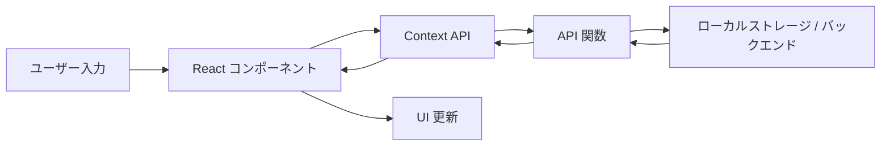
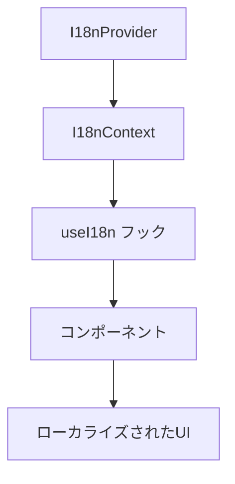

# OpenFisca Editor アーキテクチャ

このドキュメントでは、OpenFisca Editor のアーキテクチャと技術スタックについて説明します。

## 技術スタック

- **フロントエンド**: Next.js（React）、TypeScript
- **スタイリング**: Tailwind CSS、shadcn/ui コンポーネント
- **状態管理**: React Context API
- **データ保存**: ローカルストレージ（クライアントサイド）
- **バックエンド接続**: OpenFisca API（オプション）
- **国際化**: i18n（日本語、英語、フランス語対応）
- **可視化**: Plotly.js（3Dシミュレーションビジュアライゼーション）、Mermaid.js（フローチャート）

## アプリケーション構造

## ディレクトリ構造

アプリケーションは以下のディレクトリ構造で整理されています：

- `app/`: Next.js アプリケーションのルートディレクトリ
  - `page.tsx`: ホームページ
  - `layout.tsx`: アプリケーションレイアウト
  - `globals.css`: グローバルスタイル
  - `api/`: API ルート
    - `openai/`: OpenAI API 関連
  - `docs/`: ドキュメントページ
  - `institutions/`: 制度詳細ページ
- `components/`: React コンポーネント
  - `ui/`: 汎用的な UI コンポーネント（shadcn/ui）
  - `editor/`: コードエディタ関連のコンポーネント
  - `institution/`: 制度関連のコンポーネント
  - `test/`: テスト関連のコンポーネント
  - `visualization/`: 可視化関連のコンポーネント（MermaidPanel、シミュレーション可視化）
  - `simulation/`: シミュレーション関連のコンポーネント
  - `layout/`: レイアウト関連のコンポーネント
  - `shared/`: 共有コンポーネント
- `contexts/`: React コンテクスト
  - `test-context.tsx`: テスト実行と結果の状態管理
- `lib/`: ユーティリティ関数、型定義など
  - `types.ts`: アプリケーション全体の型定義
  - `api.ts`: API 関数
  - `utils.ts`: ユーティリティ関数
  - `i18n/`: 国際化関連
    - `locales/`: 各言語のリソース
- `public/`: 静的ファイル
  - `docs/`: ドキュメントファイル（マークダウン）

## データフロー

## 主要コンポーネント

### OpenFiscaEditor

アプリケーションのメインコンポーネントで、制度の管理と表示を担当します。サイドバー、InstitutionDetails、TestCasePanel、CodeEditorPanel、MermaidPanel、SimulationPanelなどのコンポーネントを組み合わせて全体のUIを構成します。

### InstitutionDetails

選択された制度の詳細情報を表示・編集するコンポーネントです。制度の基本情報、利用条件、パラメータなどを管理します。

### TestCasePanel

制度のテストケースを管理するコンポーネントです。テストケースの追加、編集、実行、結果の表示などの機能を提供します。テスト実行時には TestContext を通じて状態を管理します。

### CodeEditorPanel

OpenFisca のコードを編集するコンポーネントです。シンタックスハイライト機能を提供し、制度の計算ロジックを定義するためのインターフェースを提供します。

### SimulationPanel

シミュレーションを実行し、結果を3D可視化するコンポーネントです。Plotly.jsを使用して、制度の効果を視覚的に表現します。特定の制度（子育て助成金、3の倍数給付金など）には専用のシミュレーションロジックが実装されています。

### MermaidPanel

制度のフローチャートを表示するコンポーネントです。Mermaid.jsを使用して、制度の流れや条件分岐を視覚化します。

## 国際化対応

アプリケーションは以下の3つの言語に対応しています：

- 日本語（デフォルト）
- 英語
- フランス語

国際化は React コンテクストを使用して実装されており、言語選択はローカルストレージに保存されます。

## API 関数

API 関数は `lib/api.ts` で定義されており、以下の機能を提供します：

- 制度の取得、作成、更新、削除
- テストの実行
- パラメータの管理
- シミュレーションの実行
- OpenFisca 形式へのエクスポート

これらの関数は現在、主にローカルストレージを利用してデータを管理していますが、将来的にはバックエンドAPIとの連携を強化する予定です。

## Context API

アプリケーションはテスト関連の状態を管理するために React Context API を使用しています：

- `TestContext`: テスト実行状態と結果を管理

## コンポーネント整理の方向性

現在、`visualization/` と `simulation/` ディレクトリに類似したコンポーネントが存在しています。今後のリファクタリングでは、これらのコンポーネントを整理し、責務を明確化する予定です。

- `visualization/`: フローチャートや静的な可視化を担当
- `simulation/`: インタラクティブなシミュレーションと結果の可視化を担当

## 今後の改善点

- **コンポーネントの整理**: 重複コンポーネントの統合と責務の明確化
- **テスト機能の強化**: より詳細なテスト結果表示とバッチテスト機能
- **バックエンド連携の改善**: OpenFisca API との連携強化とデータの永続化
- **国際化対応の強化**: より多くの言語と地域設定のサポート
- **パフォーマンスの最適化**: 大量データ処理時のパフォーマンス向上
- **UI/UX の改善**: より直感的なインターフェースとビジュアライゼーションの強化
